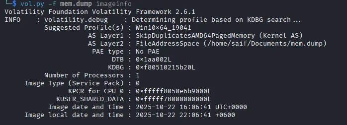
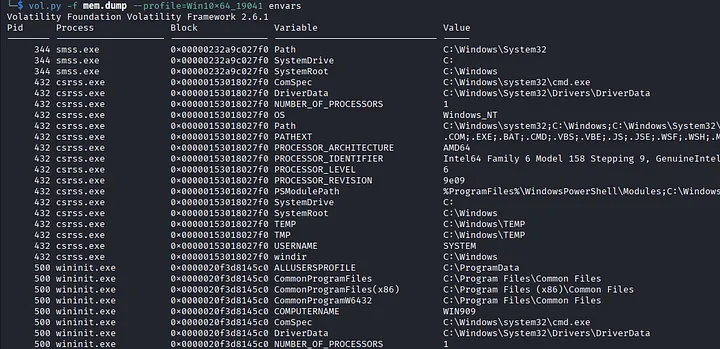
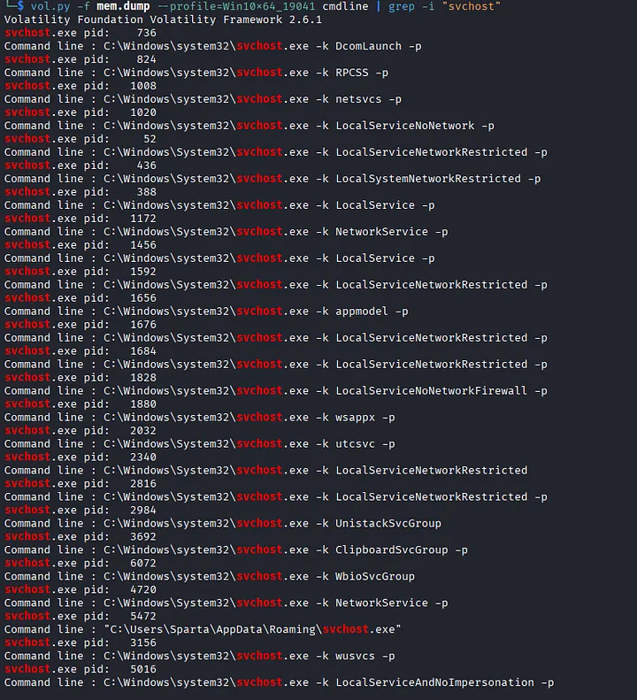
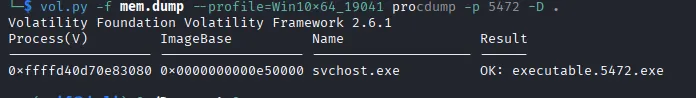
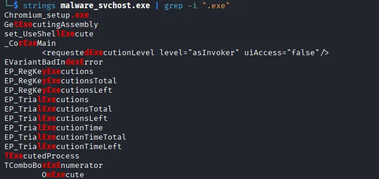
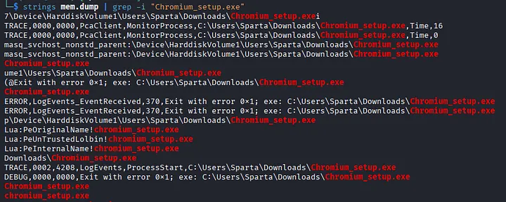
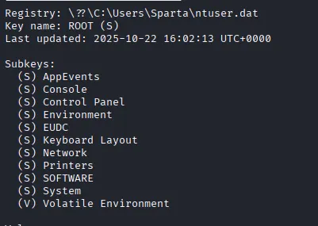
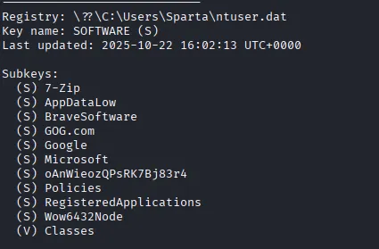
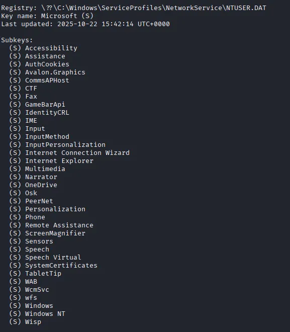
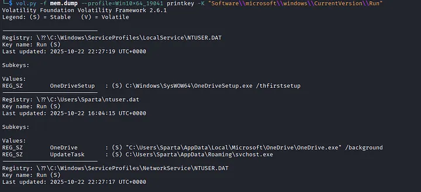

# DIU CYBERCON 2025

## FORENSICS

#### 0x1: 
The problem asked to find the biuld number and the computer name for memory dump file named mem.dump.

==> It was quite the easiest one. Simply just run the **imageinfo** using volatility2 or volatility3 whichever you want. I used volatility 2 here to solve these problems.



Here the build number is clearly shown in the profile. {19041}
To find the computer name I searched for the **envars** as it contains different types of variables and their values.



From the output I saw the COMPUTERNAME variable under pid 500. {WIN909}.

#### 0x2: 
In this case, we were supposed to find a malicious file that was executed by the user.

==> To solve this, I searched for the cmdlines to see what did he actually ran.



This will show many processes that were executed. I noticed that **svchost**, a system application used to manage background running applications is being called through a user’s own directory and not from the windows.
That clearly tells that **svchost** with pid **5472** was tha malicious file. (As I already found that before that’s why i filtered using grep)

#### 0x3:
The statements were

Challenge: What is the full path of the ORIGINAL malicious executable?

Task: Find where the malware originally came from before it copied itself to AppData\Roaming

==> As I already got the pid of the malicious file so I used **procdump** to analyze that file.



Then I renamed the file. Note: Don’t try to run the exe file at all.



As it svchost wasn’t the original name that means the file would have a real name and the extension of exe as well. So I searched strings to find words with the sub-string **“.exe”** and found an interesting thing.

```
Cromium_setup.exe
```

That was the only executable file listed here, so I was quite sure about that but I needed to find the full path of it. Then I again used strings and grepped **“Cromium_setup.exe”**.



Here I got the path that we were looking for.

#### 0x4:

#### 0x5: 
The problem was : What registry path + value was used for persistence?

==> I ran the following command to view the registry:

```
vol.py -f mem.dump --profile=Win10x64_19041 printkey
```



This allowed me to navigate the registry and identify the persistence mechanism used by the malware.


At first I didn’t understood anything, then I took a little help from gpt and the got to know that every subkey leads to another state. So, I again searched using print key and SOFTWARE as key.



The deeper I go the more I could find.



After taking help from AI I finally got the full key that leads me to the UpdateTask of svchost.exe.



And the key value that was run for persistance is **“Run”**. Also we got the registry path that will start with **HKCU**.


