#JKKNIU Cyber Security Club Monthly Contest 5

###Reverse Engineering:

####(1)Open Code:
Points: 50
A binary file “test” was added.

Solve: At first I made it executable by using the command **chmod +x test**. Then ran the file which lead to something like
	J
	*** stack smashing detected ***: terminated
	[1] 8579 IOT instruction (core dumped) ./test
Nothing useful. Then I opened it on cutter and got a main function

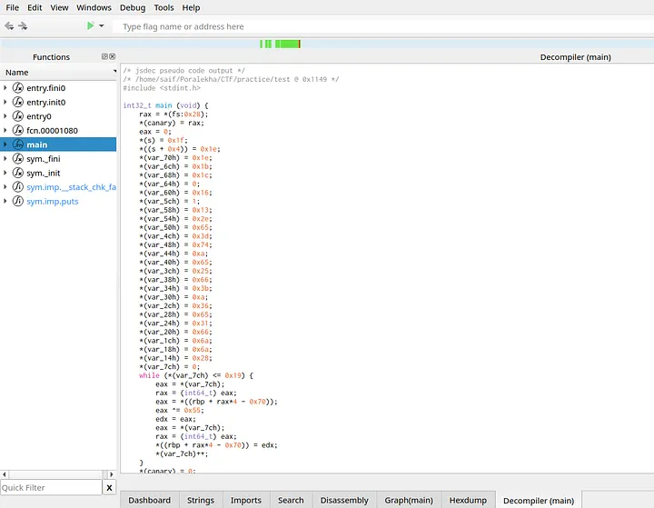

Press enter or click to view image in full size

It did call two other functions but not seemed to be useful. So i used chatgpt and asked to make the code human readable

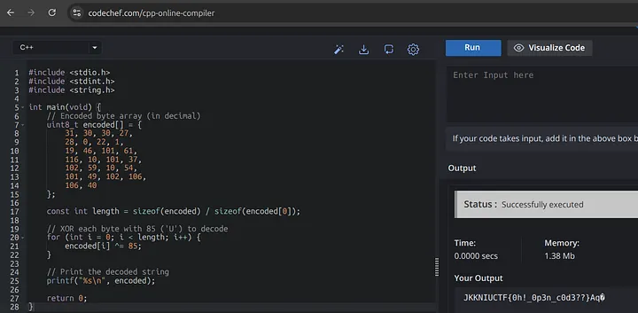

Press enter or click to view image in full size

There we go. The flag is : JKKNIUCTF{0h!_0p3n_c0d3??}

####(2) Logic:

Points: 150
A binary file “iloveYOutoo” was added.

Solve: At first I made it executable by using the command chmod +x iloveYOutoo. Then ran the file which lead to:

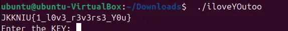

So, Flag : JKKNIU{1_l0v3_r3v3rs3_Y0u}

####(3) What’s up?

Points: 100
A binary file “run_to_get” was added.

Solve: At first I made it executable by using the command chmod +x run_to_get. Then ran the file which lead to something like

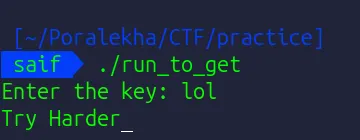

Then I tried hexdump with xxd run_to_get and saw

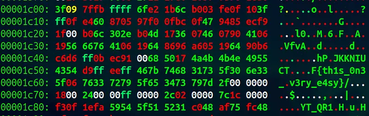

Press enter or click to view image in full size

Which did the work for me. So, Flag is : JKKNIUCTF{th1s_0n3_v3ry_e4sy}
Note: “strings run_to_get” will also do it.

####(4) Bitty encryption:

Points: 50
The file is under maintenance, and each part is highly suspicious. Can you dig up my pass? Format: JKKNIUCTf{flag} . A binary file “bitty” was added.

Solve: At first I made it executable by using the command chmod +x bitty. Then ran the file which lead to something like

./bitty
Enter The Correct Password:hghghgh
WrongGuess%
Nothing helpful. So, i needed a help from gpt. After providing the info and some texts it returned a pycode.

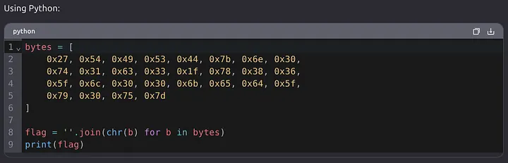

Press enter or click to view image in full size

Running the code gives the output:

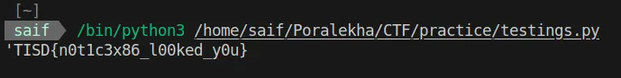

To make it look like the flag formet I change the “TISD” with “JKKNIUCTF”.

So, the flag is : JKKNIUCTF{n0t1c3x86_l00ked_y0u}

####(5)dot.Awesome code

Points: 200
A binary file “challenge.ove” was added.

Solve: At first I made it executable by using the command chmod +x challenge.ove . Then ran the file which lead to something like

./challenge.ove
Enter the secret key: hhhh
Access Denied!
Nothing as usual. Then i tried strings and cutter but got only a little part of it.

	**rsi = “]\\Y^BTCQl’dzH&yH$a$en`”;**

Using xor with 0x17 gives JKKNIUCTF{0sm_1n_3v3ryw. I tried to guess the flag with similar words but couldnt find appropriate answer.

Then i used hexdump: xxd challenge.ove and got

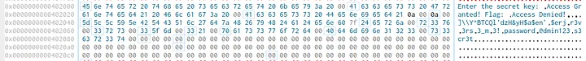

Press enter or click to view image in full size

Here I got an interesting string “r3v3rs3_m3!” , which I used ask the key and got

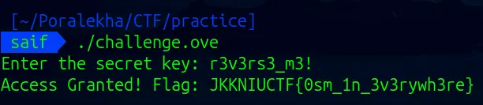

So the flag is : JKKNIUCTF{0sm_1n_3v3rywh3re}

###Steganography:

####(1) Tall Tale:

Points: 50
When dimensions don’t align with expectations, secrets surface. Adjust wisely — only one axis holds the key. An image “stego.png” was added.

Solve: I checked zsteg, binwalk, exiftool but none of them worked.So, I checked the file data

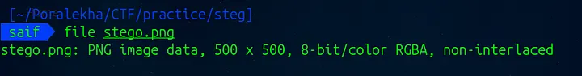

Press enter or click to view image in full size

I saw the description and thought to make the image scale a little higher. So i used Gimp to make it 500x1000 from 500x500. And the flag was at the bottom of the picture. (Note: I faced some issue with the image downloaded from the contest link, so I took the real image from the author)
If Gimp doesn’t work we can also use hexedit and then change the height value from 01 F4 to 03 E8 and save the picture.

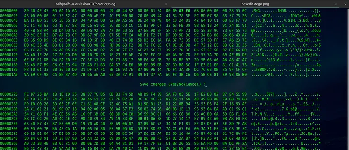

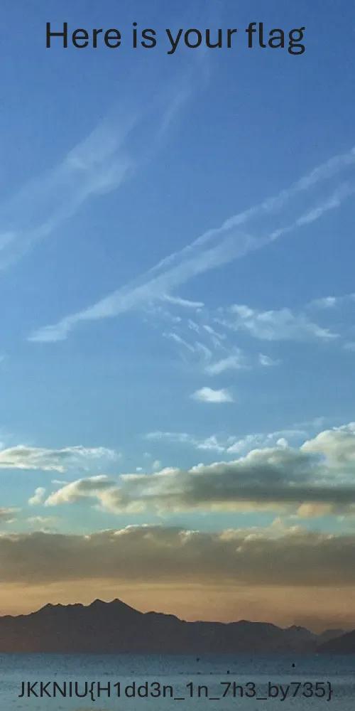

Press enter or click to view image in full size

Then here is the flag : JKKNIU{H1dd3n_1n_7h3_by735}

####(2) Audio:

Points: 100
Do you know the telephone number of Belabose? An audio file named “steg.wav” was added. (underscore ‘_’ was supposed to be replaced in the place of any special character)

Solve: At first I tried Audacity to find spectrogram layer empty. Then I googled ‘telephone tone decoder’ and got a link named DTMF Decoder and entered there to provide the file. Then I got something like

Press enter or click to view image in full size

So the flag is: JKKNIUCTF{C0D3_2441139}

####(3) Bagged up:

Points: 100
Beneath the burden of countless bags, something concealed waits silently. Only the name that carries weight here can unlock the truth. An image named “challenge_1.jpg” was added.
Hint: Do you know the github id of the author?

Solve: As I saw it was .jpg I tried binwalk, exiftool, binwalk -e but nothing was useful. Then I saw the hint and tried out **steghide extract -sf challenge_1.jpg** with the password “Ki6uiPar1na” which was the github id name. This gave me secret.txt file where i found a huge text

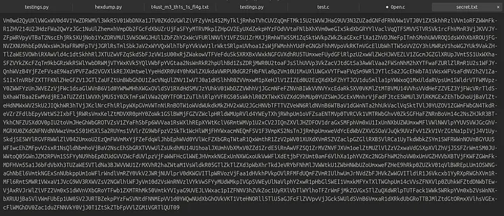

Press enter or click to view image in full size

Then opened CyberChef and decoded with base64 several times untill it gives the final flag.

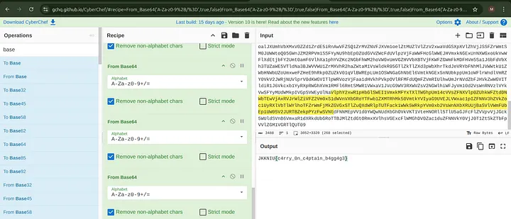

Press enter or click to view image in full size

Flag: JKKNIU{c4rry_0n_c4pta1n_b4gg4g3}

####(4) Meow:

Points: 100
What you see is only the surface — beneath lies a compressed secret waiting to be uncovered. Dive into the layers and inspect every detail; the key to unlock the treasure is hidden within the quiet corners beyond sight. — *Flag Format: JKKNIU{some_text}.
A cat.jpg file was added.

Solve: At first I checked the file type and saw

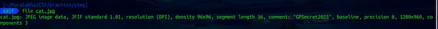

Press enter or click to view image in full size

“GPSecret2025" a suspicious comment. So, I used binwalk -e to see if there was anything compressed and found a zip file.

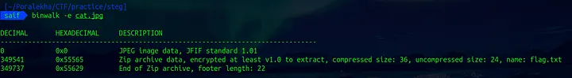

Press enter or click to view image in full size

Then I unzipped the file with the password and got flag.txt file and the ans was: JKKNIU{y0u_f0und_m30w!}

####(5) Spectral Noise:

Points: 100
An image stego.png was added.

Solve: As it was a png file i tried zsteg at first

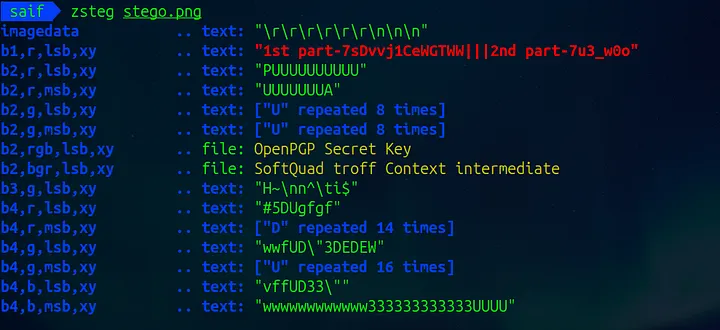

Press enter or click to view image in full size

Here I saw two parts of the flag and encoded in two different ways. The first part was encrypted through **base58**

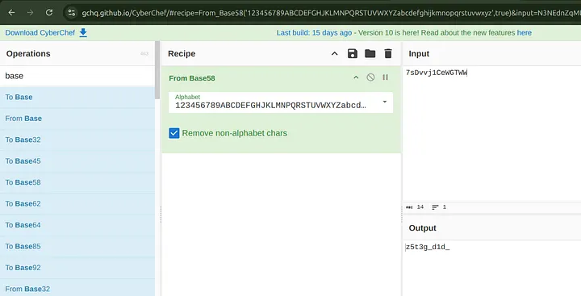

Press enter or click to view image in full size

Then I decrypted the second one with Ceaser Cipher or basically **ROT13**

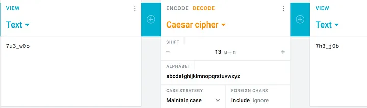

Press enter or click to view image in full size

So, the flag stands: JKKNIUCTF{z5t3g_d1d_7h3_j0b}

Thank_you!
