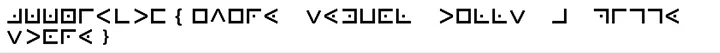
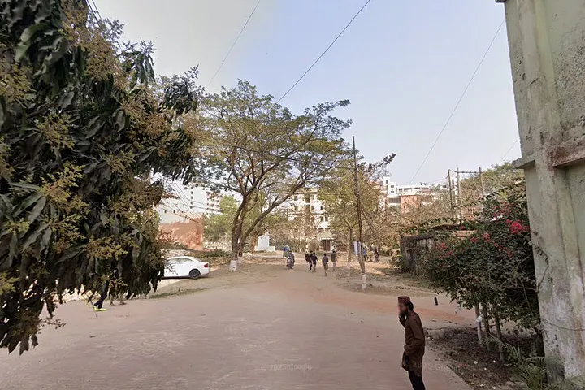
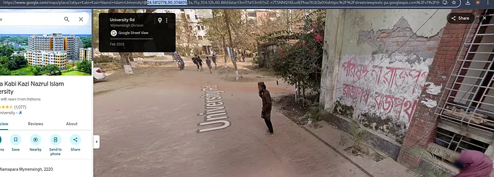
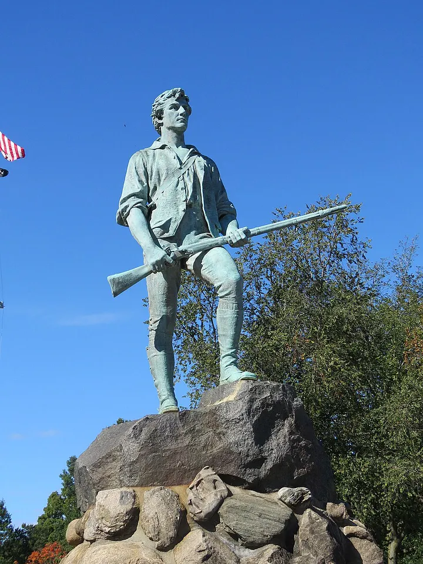
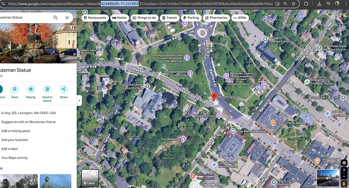
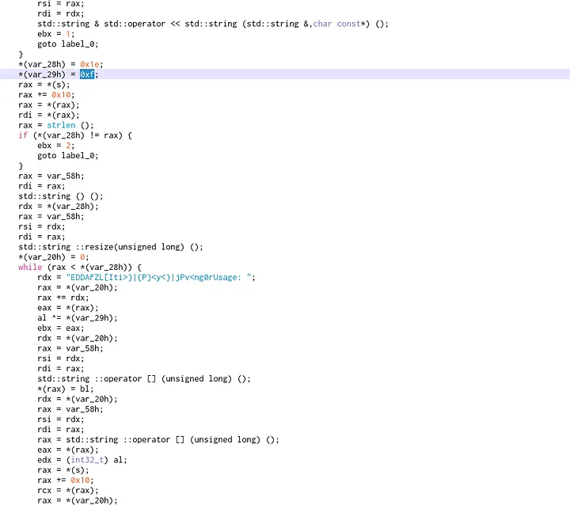
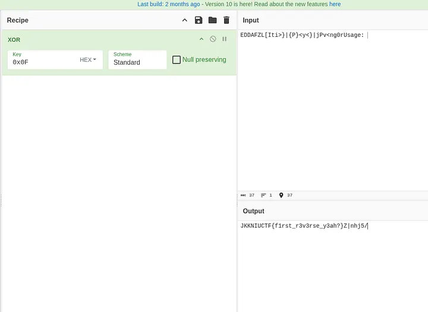
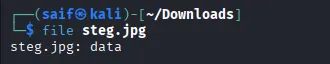
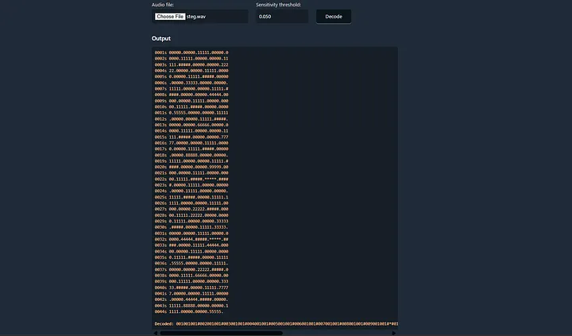
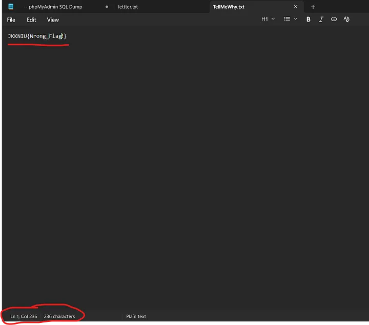

# JKKNIU Cyber Security Club Monthly Contest 7

### Cryptography
#### (1)Crypto1
Numbers, numbers everywhere… but what do they mean?
Maybe each pair has something to say.

4a 4b 4b 4e 49 55 43 54 46 7b 68 75 72 72 34 79 21 5f 79 6f 75 5f 73 30 6c 76 33 64 5f 31 74 21 7d

Flag format: JKKNIUCTF{…}

Solve: A bunch of hex. Copy and paste in cipher identifier **(https://www.dcode.fr/cipher-identifier)**. Go to the top priority field, that’s ASCII Code. Decode it.

#### (2)Crypto2
In a quiet village a clever little pig loved to doodle symbols in the dirt.

Flag format: JKKNIUCTF{flag_here}
Also an image was here.

Solve: Searching on the internet provides the result **Pigpen cipher**. Same as the previous one. In cipher indetifier search for Pigpen and open that. Type exactly the same and decode it.

#### (3)Crypto3
WXXAVHPGS{Q0_H_Y1X3_PGS?}
What is it?

Solve: Search for **rot13**.(Same as before)

#### (4)Crypto4 & I can’t see anything
**(c4)**Our very first step into coding… some things are easier to see than others.

**(Icsa)**An important message is hidden where you least expect it — the text is present but invisible against a bright background.

Solve: Both of these can be done by **“Whitespace Language Decoder”** from cipher identifier.

#### (5) Crypto5
check the link carefully. **https://jkkniuctf.xyz/challenges?cypto=lBjqJfcqgaxbAE0nfKJmtJFgpcHtqoVc6SQu**

Solve: Just take the encoded string after “=”. Reverse it and decode with something related to ‘base’.

#### (6) 90’s Supremacy
When I use my button phone, I can send a message to anyone — even from the shadows of my pocket.

Flag Format: JKKNIUCTF{Some Text Here}

Cipher Text:

7 88 777 33 0 555 666 888 33 0 666 66 555 999 0 33 99 444 7777 8 33 3 0 444 66 0 8 44 33 0 66 444 66 33 8 444 33 7777

Solve: Follow Crypto1 procedure.

#### Forensic

#### (1)You know about Protocol?
During a routine network capture, suspicious activity was detected in HTTP traffic. Analyze the PCAP and uncover the secret. ** Flag format**- JKKNIUCTF{…}

Solve: ***Incomplete***

### MISC

#### (1)The Secret of L
“Don’t you know me? Know me… and only then will the truth be revealed.”

Flag format: JKKNIUCTF{s0m3th1n6 h3re}

Solve: We got a png image. Analyse it using **“zsteg”**. There is a suspicious string in a specific formet. An unrecognizable one. But we know the flag starts with JKKNIUCTF. Use **Vigenre Cipher** from cipher identifiers applying this known text and decode.

### OSINT

#### (1)Find the criminal
Whare is Shafinkun?

Become a member
Flag format: JKKNIUCTF{10.454533_56.123123}

Solve: The image clearly shows Shafin Vai waiting for his Fiancee as the campus was empty that day. But he forgot there is no privacy in any street of Trishal. So I searched the **google maps** and found the exact same picture revealing his position also his Fiancee behind him, in front of the Science and Engineering Faculty. (Caught XD)

#### (2)Osint2
A mysterious photo has surfaced.
Can you find where it was taken?

Submit the coordinates in the format: JKKNIUCTF{Latitude,Longitude}

File: Statue.jpg

Solve: Searching the web will show that it’s a **Minuteman statue**. Remember there are many Minuteman Statutes all over the USA. So be sure which one we are looking at. This time its Lexington Minuteman Statue. Search the google maps or any site and find the location, mentioned in the url. (The position of the picture also varies the location values).

### Reverse Engineering

#### (1)Check The Password
You know how to check Password?

Solve: I opened the binary with cutter and saw…

A strange string going through some operation with some specific values. So, I opened the cyberchef and tried to unveil the string using XOR and it reveiled the password.

### steganography

#### (1)steganography1
A secret message has been hidden inside this image.
Can you extract it? File: EX1T.png
Hint: Look carefully inside the image. Flag format: JKKNIUCTF{…}

Solve: As it is a png file. Using just **zsteg** would do the work.

## (2)steganography2
Something seems hidden in this image.
It’s not plain to read — you’ll need to look closer and figure out what’s going on.

File: EX!T.png
Hint: Think about secrets inside images and maybe some cipher.
Flag format: JKKNIUCTF{…}

Solve: Same as the previous one. Just this time we got an encoded string. Now use your Cryptography skills.

## (3)Again in plain
Something looks off with this image… can you bring it back to life?

Solve: We got a steg.jpg file but using “file” we can see its in data format.

Change the file **magic number** for jpg and get the result.

#### (4)Again 90’s Supremacy
A note from a friend can brighten your day. A ring on the phone might come close. Inside this archive, you’ll find a letter and a voicemail. Each holds a clue to the other. Listen to the tones, follow the letters, and uncover the hidden phrase. Then submit the flag in the format.

Solve: There are two files. An audio and a text file.

The audio was decoded through **DTMF decoder** and then the result was a bit tricky.
001001001#002001001#003001001#004001001#005001001#006001001#007001001#008001001#009001001#*#010001001#011001002#012001003#013001004#*#014001001#015001002#016001003#017001004#018001005

The text:
Jovial lanterns swung along the quay.
Kindred whispers crossed the midnight air.
Kestrels traced slow circles in the haze.
Nightfall braided silver into the waves.
Iridescent dew freckled the meadow grass.
Underfoot, the path hummed secrets.
Corded ropes creaked against the pier post.
Twilight folded itself into quiet pockets.
Faint chiming answered from the bell tower.
Eager foxes danced beyond the fence.
Barrel lanterns guided the shore.
Mascot trailed behind the carriage.
Playful children skipped through puddles.
playful boats rocked near the pier.
beacon lanterns guided the channel.
search parties called through the fog.
this harbor hummed with distant bells.
sunny mornings promised small delights.

These resembel the line, the word and the letter respectively where # is the divider and * is speciall chars. Find the flag using the text file and decoded hint.

#### (5)Steganography3
A melody hides more than music.
Not everything you hear is meant to be heard.

File: Apt.mp3 Hint: Think visually as well as audibly.
Flag format: JKKNIUCTF{…}

Solve: An Apt.mp3 file was given.
Ever used an audio stegangraphy tool?
Try this one **https://www.stegonaut.com**.

#### (6)TellMeWhy
What you see is a drop, what you don’t see is an Ocean.
A file tellmewhy.txt was given.
Solve:

Watch carefully. There are only few lettersbut the information shows it has 236 chars. Interesting isn’t it. It’s call Zero width spacing. Search for **“Unicode Steganography with Zero-Width Character”** and decode.